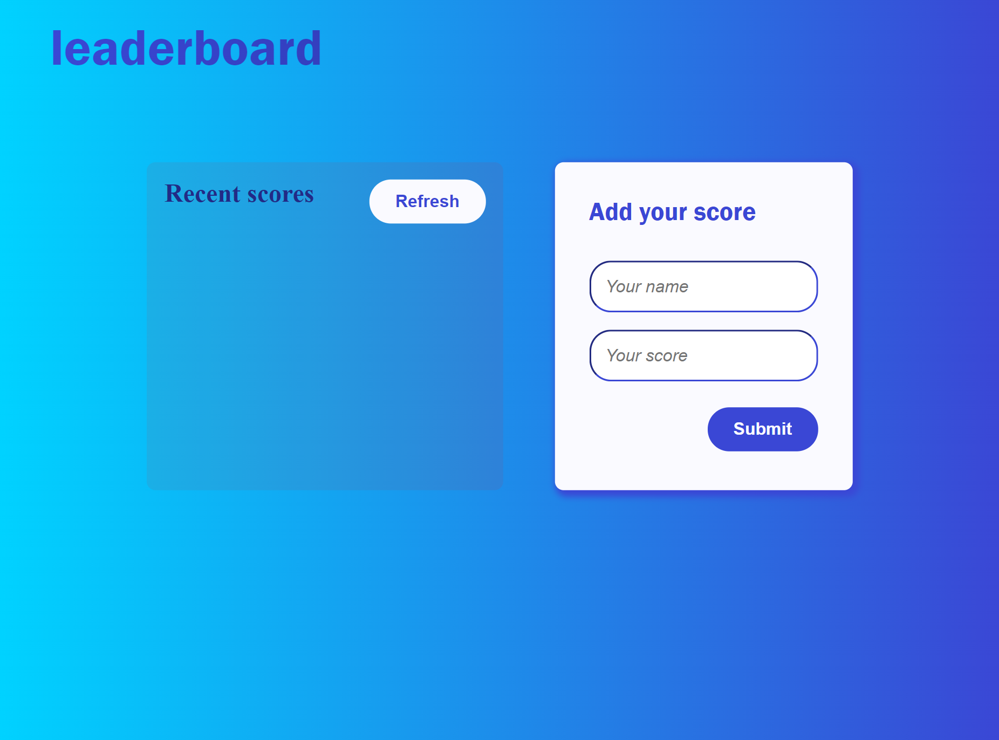

# Leaderboard

> Leaderboard where you can show your scores and more scores.

## Built With

- HTML
- CSS
- JAVASCRIPT
- WEBPACK

## Live demo
[Live Demo Link](https://youmari.github.io/portfolio/)

## Getting Started

** Follow the instructions for using this webapp.**

To get a local copy up and running follow these simple example steps.

### Setup
- clone the project to your local machine
### Install
- in the root directory run the command ** npm install ** to install the dependencies

### Usage
    in the root directory run the command " npm start " to see the website in the browser
    

👤 **Youmari**

- GitHub: [@youmari](https://github.com/youmari)
- Twitter: [@yf_omari](https://twitter.com/yf_omari)
- LinkedIn: [LinkedIn](https://www.linkedin.com/in/yassine-omari-945114190/)

## 🤝 Contributing

Contributions, issues, and feature requests are welcome!

Feel free to check the [issues page](../../issues/).

## Show your support

Give a ⭐️ if you like this project!
